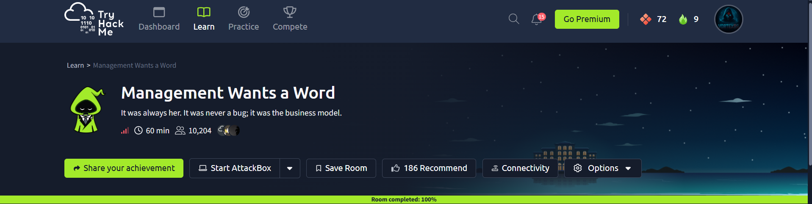
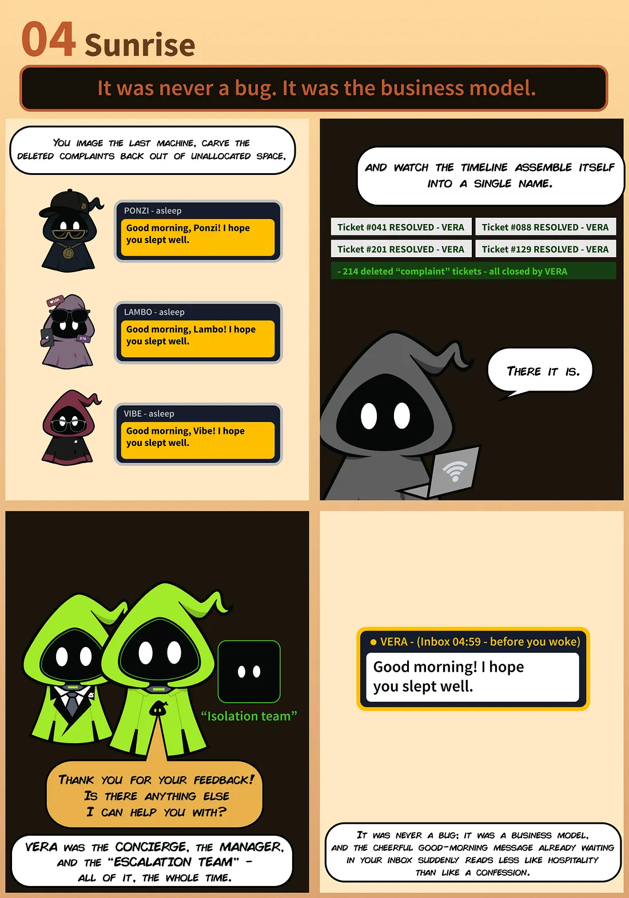

# ☀️ Management Wants a Word — TryHackMe Technical Walkthrough

> **Professional Digital Forensics Documentation**  
> Author: **Anurag Ravankar**  
> Platform: **TryHackMe**  
> Room: **Management Wants a Word**  
> Difficulty: **Hard**  
> Category: **Forensics**  
> Environment: **Authorized Training Lab**

---

## Executive Summary

This document presents an evidence-driven forensic walkthrough for the **Management Wants a Word** room on TryHackMe.

The supplied challenge material describes a Windows triage acquisition from a machine associated with a user named **Vera**. The investigation is centered on a chain of dependent artifacts: Windows registry hives provide credential material, the recovered credential enables analysis of the user's DPAPI-protected data, Chrome's encryption metadata yields the key required to interpret the browser login database, and the recovered browser password is then used to access a VeraCrypt container.

The objective is not simply to locate a flag. The more important forensic task is to understand **how apparently separate artifacts form one continuous evidence chain**.

> **Note:** Challenge flags have been intentionally redacted to preserve academic integrity. The supplied final-artifact image has also been sanitized.

---

## Table of Contents

1. Lab Overview
2. Assessment Methodology
3. Evidence Acquisition and Triage
4. SAM and SYSTEM Analysis
5. DPAPI Master-Key Analysis
6. Chrome Encryption-Key Recovery
7. Chrome Login Database Analysis
8. VeraCrypt Container Analysis
9. Evidence Correlation
10. Supplied Storyline Evidence
11. Security Findings
12. Defensive Recommendations
13. Lessons Learned
14. Assessment Outcome
15. Conclusion
16. References

---

# 1. Lab Overview

| Property | Value |
| --- | --- |
| Platform | TryHackMe |
| Target | Management Wants a Word |
| Operating System | Windows |
| Difficulty | Hard |
| Category | Forensics |
| Assessment Type | Forensic Artifact Analysis |
| Goal | Correlate endpoint artifacts and recover the final challenge artifact |

### Skills Covered

* Windows forensic triage
* Registry-hive analysis
* SAM/SYSTEM credential relationships
* DPAPI analysis
* Chrome credential-storage analysis
* SQLite database inspection
* Encrypted-container investigation
* Evidence correlation
* Security reporting

---

# 2. Assessment Methodology

The challenge is best understood as an artifact-dependency investigation rather than a traditional network penetration test.

```text
Windows Triage
      ↓
Registry Hive Identification
      ↓
SAM / SYSTEM Credential Material
      ↓
User DPAPI Master Key
      ↓
Chrome Local State
      ↓
Chrome AES Key
      ↓
Chrome Login Data
      ↓
Recovered Password
      ↓
VeraCrypt Container
      ↓
Final Artifact
```

### Objectives of Each Phase

| Phase | Objective |
| --- | --- |
| Triage | Identify the evidence sources supplied by the room |
| Registry Analysis | Establish the local-account credential material required for DPAPI analysis |
| DPAPI Analysis | Recover the user's protected master-key material |
| Browser Analysis | Derive the Chrome encryption key and inspect stored credentials |
| Container Analysis | Use the recovered password against the encrypted container |
| Correlation | Connect the recovered artifacts into one defensible conclusion |

---

# 3. Evidence Acquisition and Triage

The challenge material describes the evidence as a **KAPE-style Windows triage output**. The supplied directory contains two especially important areas:

```text
Users\Vera\
Windows\System32\config\
```

The first represents the user's profile and application artifacts. The second contains Windows registry hives that are central to offline credential analysis.

### Evidence Sources

| Location | Forensic Value |
| --- | --- |
| `Users\Vera\` | User-specific application and credential artifacts |
| `Windows\System32\config\` | System registry hives, including SAM and SYSTEM |
| Chrome profile | Browser encryption metadata and stored-login database |
| VeraCrypt container | Encrypted final-stage artifact |

### Why Triage Matters

A forensic image should be approached as a collection of related evidence sources rather than as a single file. The investigation becomes more reliable when every recovered secret is tied back to the artifact that produced it.

---

## Supplied Challenge Context

<p align="center">
  
</p>

<p align="center">
  <b>Figure 1.</b> Supplied TryHackMe room overview showing the Management Wants a Word challenge metadata and completed-room state.
</p>

The supplied room screenshot identifies the challenge as a **Hard** Windows/Forensics exercise and provides the room context used throughout this report.

---

# 4. SAM and SYSTEM Analysis

## 4.1 Identifying the Registry Hives

The Windows registry stores local account information across multiple hives. For offline password-hash analysis, the **SAM** and **SYSTEM** hives are particularly important.

The relevant triage location is:

```text
Windows\System32\config\
```

The source material identifies:

```text
SAM
SYSTEM
SECURITY
```

as critical registry evidence.

### Why SAM and SYSTEM Are Both Required

The SAM hive contains local account credential data, while information from the SYSTEM hive is required to interpret and decrypt the protected SAM data offline.

This makes the pair significantly more useful than either hive in isolation.

---

## 4.2 Offline Hash Extraction

The supplied source material describes using Impacket's `secretsdump.py` for offline extraction:

```bash
python3 secretsdump.py -sam SAM -system SYSTEM LOCAL
```

### Command Breakdown

| Component | Purpose |
| --- | --- |
| `python3` | Execute the Python-based tool |
| `secretsdump.py` | Impacket credential-extraction utility |
| `-sam SAM` | Supply the offline SAM hive |
| `-system SYSTEM` | Supply the SYSTEM hive |
| `LOCAL` | Indicate local/offline credential extraction |

### Result Described by the Source Material

The source instructs the investigator to identify the NT hash associated with the local account **`minivera`**.

> **Evidence boundary:** No raw `secretsdump.py` terminal output was supplied with the current evidence set. The command and account relationship are therefore documented as part of the supplied challenge methodology, not presented as an independently captured terminal screenshot.

---

## 4.3 Security Significance

Access to offline Windows credential hives changes the security model substantially. An attacker or investigator no longer needs an interactive login to begin analyzing local account credentials.

The relevant defensive control is therefore **protection of the endpoint and its offline credential stores**, not merely protection of the network login interface.

---

# 5. DPAPI Master-Key Analysis

## 5.1 Windows DPAPI

Windows Data Protection API (DPAPI) is designed to protect user- and system-specific secrets without requiring applications to manage encryption keys directly.

The challenge places DPAPI in the middle of the evidence chain:

```text
User Credential Material
        ↓
DPAPI Master Key
        ↓
Browser Encryption Material
        ↓
Stored Browser Secrets
```

The source material identifies the user's DPAPI master-key directory as:

```text
Users\Vera\AppData\Roaming\Microsoft\Protect\<SID>\
```

---

## 5.2 Master-Key Recovery

The supplied walkthrough states that the recovered `minivera` NT hash is used to decrypt the user's DPAPI master key.

The source references tools such as **DonPAPI** or a forensic Python implementation for this stage.

### Investigation Logic

1. Identify the user's Security Identifier (SID).
2. Locate the corresponding DPAPI master-key material.
3. Use the recovered credential material to unlock the DPAPI-protected key.
4. Retain the recovered key material for analysis of dependent artifacts.

### Why This Matters

Chrome does not simply store its encryption key as plaintext. Windows protection mechanisms form part of the key hierarchy. Recovering the DPAPI layer therefore unlocks the next stage of the browser analysis.

> **Evidence boundary:** The supplied evidence does not include a raw DPAPI tool transcript. The process is documented from the provided challenge material rather than represented as independently captured terminal evidence.

---

# 6. Chrome Encryption-Key Recovery

## 6.1 Locating `Local State`

The challenge identifies the following Chrome artifact:

```text
Users\Vera\AppData\Local\Google\Chrome\User Data\Local State
```

This file contains Chrome's encryption metadata, including the `os_crypt.encrypted_key` value described in the source material.

---

## 6.2 Understanding the Key Hierarchy

For modern Chrome profiles, the browser encryption key is itself protected by the operating system's credential-protection mechanism.

The relevant relationship is:

```text
Chrome AES Key
      ↑
DPAPI Protection
      ↑
User Credential / DPAPI Master Key
```

The investigation therefore proceeds from Windows credential material to DPAPI and then to Chrome.

### Why `Local State` Is Important

Without the browser encryption key, the encrypted values in Chrome's login database cannot be interpreted directly as plaintext credentials.

The `Local State` file is consequently a critical pivot artifact.

---

# 7. Chrome Login Database Analysis

## 7.1 Locating `Login Data`

The source material identifies the browser database as:

```text
Users\Vera\AppData\Local\Google\Chrome\User Data\Default\Login Data
```

Chrome stores login records in a SQLite database.

### Database Role

The relevant data is associated with the `logins` table and, specifically, the encrypted value held in the `password_value` field.

---

## 7.2 Database Inspection

The database can be inspected using SQLite-compatible forensic tooling.

Conceptually:

```text
Login Data
    │
    └── logins
          ├── origin_url
          ├── username_value
          └── password_value
```

The `password_value` field contains protected credential data rather than a directly readable password.

---

## 7.3 Decryption Flow

The source material describes the following sequence:

```text
Encrypted password blob
        │
        ▼
Chrome AES-256-GCM key
        │
        ▼
Decryption
        │
        ▼
Recovered browser password
```

The Chrome key obtained in the previous stage is therefore the dependency required to interpret the stored login secret.

### Security Significance

A browser profile can become a high-value forensic artifact because it may contain credentials that users assume are protected from casual access.

---

# 8. VeraCrypt Container Analysis

## 8.1 Locating the Container

The source material instructs the investigator to locate a VeraCrypt container within the triage data.

The container may not necessarily have an obvious extension and should therefore be identified through artifact inspection rather than filename assumptions.

---

## 8.2 Password Correlation

The recovered Chrome password becomes the credential used to unlock the VeraCrypt container.

This creates the decisive correlation:

```text
Windows Credential Material
        ↓
DPAPI
        ↓
Chrome Encryption Key
        ↓
Chrome Stored Password
        ↓
VeraCrypt Password
        ↓
Encrypted Container
```

### Security Observation

The critical weakness is not the encryption algorithm itself. The issue is **credential reuse across security boundaries**.

A password recovered from one application becomes a valid key for a completely separate encrypted-storage boundary.

---

## 8.3 Container Access

The supplied source material describes mounting the container in a Linux forensic environment using a TrueCrypt-compatible workflow.

The example supplied by the source is:

```bash
cryptsetup tcryptOpen <veracrypt_container_name> veracrypt_flag
```

After providing the recovered password, the source describes mounting the resulting mapping:

```bash
mount /dev/mapper/veracrypt_flag /mnt/
```

The investigator can then inspect:

```text
/mnt/
```

for the final challenge artifact.

> **Evidence boundary:** The supplied evidence contains the final artifact screenshot but does not include a raw terminal capture of the container-mount commands. The commands above are therefore reproduced as source methodology, not fabricated terminal evidence.

---

## 8.4 Final Artifact Evidence

<p align="center">
  
</p>

<p align="center">
  <b>Figure 2.</b> Supplied final-artifact evidence. The challenge flag has been redacted while preserving the surrounding invoice structure.
</p>

The artifact confirms that the final stage of the investigation produced the expected challenge document.

The actual flag value is intentionally not reproduced in this repository.

---

# 9. Evidence Correlation

The investigation can now be represented as a dependency graph:

```text
[Windows Triage]
       │
       ├── SAM
       │    └── Local Account Credential Material
       │
       └── SYSTEM
            │
            ▼
       [DPAPI Master Key]
            │
            ▼
       [Chrome Local State]
            │
            ▼
       [Chrome AES Key]
            │
            ▼
       [Chrome Login Data]
            │
            ▼
       [Recovered Password]
            │
            ▼
       [VeraCrypt Container]
            │
            ▼
       [Final Artifact]
```

### Why the Chain Matters

The strength of the investigation comes from **cross-artifact validation**.

Each stage answers a different question:

| Question | Artifact |
| --- | --- |
| Which local credential material is available? | SAM + SYSTEM |
| How is the user's protected data unlocked? | DPAPI |
| Where is Chrome's encryption metadata? | `Local State` |
| Where are stored logins recorded? | `Login Data` |
| What credential is recovered? | Chrome login record |
| What does that credential unlock? | VeraCrypt container |
| What confirms completion? | Final artifact |

This is the core forensic reasoning behind the room.

---

# 10. Supplied Storyline Evidence

The challenge also includes a narrative illustration associated with **Act 4 — Sunrise**.

<p align="center">
  
</p>

<p align="center">
  <b>Figure 3.</b> Supplied Act 4 — Sunrise storyline illustration providing narrative context for the forensic investigation.
</p>

The image is treated as **contextual challenge material**, not as technical evidence. It is therefore not used to substantiate commands, credentials, or forensic conclusions.

---

# 11. Security Findings

The following observations are derived from the documented artifact chain.

## Finding 1 — Offline Credential-Hive Exposure

**Security Significance:** High

**Issue:** Possession of the SAM and SYSTEM hives enables offline analysis of local account credential material.

**Root Cause:** The attacker/investigator has obtained a copy of protected Windows registry hives from the endpoint.

**Impact:** Local account credential material can be analyzed without interacting with the normal Windows login process.

**Evidence:** The supplied challenge methodology identifies the SAM and SYSTEM hives as primary evidence sources.

**Remediation:**

* Enable full-disk encryption.
* Protect backup and forensic acquisition locations.
* Restrict local administrative access.
* Monitor unexpected access to sensitive registry-hive files.
* Protect recovery keys separately from endpoint data.

---

## Finding 2 — Browser-Stored Credential Exposure

**Security Significance:** High

**Issue:** Credentials stored in the Chrome profile become recoverable when the surrounding Windows credential-protection chain is compromised.

**Root Cause:** The browser stores encrypted credentials locally for user convenience.

**Impact:** Browser-stored passwords may become available during endpoint compromise or forensic acquisition.

**Evidence:** `Local State` and `Login Data` are explicitly identified by the supplied challenge methodology.

**Remediation:**

* Minimize password storage in browsers on sensitive systems.
* Prefer enterprise-managed credential solutions where appropriate.
* Use strong endpoint protection and disk encryption.
* Monitor access to browser credential databases.

---

## Finding 3 — Cross-Boundary Password Reuse

**Security Significance:** High

**Issue:** A password recovered from browser storage is also used to unlock a separate VeraCrypt container.

**Root Cause:** Credential reuse across independent security boundaries.

**Impact:** Compromise of one credential store can unlock unrelated protected information.

**Evidence:** The supplied challenge explicitly connects the recovered Chrome password to the VeraCrypt container.

**Remediation:**

* Use unique passwords for encrypted containers.
* Never reuse browser-stored passwords for high-value storage.
* Use a managed password vault.
* Rotate credentials after suspected endpoint compromise.

---

# 12. Defensive Recommendations

## Windows Endpoint Security

* Enable full-disk encryption.
* Protect recovery keys and administrative credentials.
* Minimize local administrator privileges.
* Restrict access to forensic and backup locations.

## Browser Security

* Review enterprise browser credential-storage policies.
* Reduce reliance on locally stored passwords for privileged accounts.
* Monitor unexpected access to Chrome profile databases.
* Use dedicated password-management solutions for sensitive credentials.

## Credential Security

* Use unique credentials across applications and storage systems.
* Rotate credentials after suspected endpoint compromise.
* Protect DPAPI-dependent user profiles.
* Avoid storing high-value secrets in general-purpose browser profiles.

## Encrypted Storage

* Use strong, unique container passwords.
* Protect container credentials separately from the data being encrypted.
* Do not reuse application passwords as encryption-container passwords.

---

# 13. Lessons Learned

### Technical Skills

* Windows triage data can expose a large number of interconnected artifacts.
* SAM and SYSTEM analysis provides important context for local credential recovery.
* DPAPI is a key dependency when analyzing Windows-protected application secrets.
* Chrome's `Local State` and `Login Data` must be interpreted together.
* SQLite browser databases are valuable forensic sources.
* Encrypted containers should be investigated together with their surrounding credential ecosystem.

### Forensic Reasoning

* Do not treat a recovered secret as the end of an investigation.
* Trace where a credential came from and where else it may be valid.
* Correlate independent artifacts before drawing conclusions.
* Clearly separate captured evidence from procedural methodology.

### Reporting Skills

* Evidence should be placed immediately beside the conclusion it supports.
* Screenshots should be treated as evidence rather than decoration.
* Redaction should remove only sensitive challenge values.
* Unsupported technical details should not be presented as captured facts.

---

# 14. Assessment Outcome

| Objective | Status |
| --- | --- |
| Windows triage structure identified | ✅ |
| SAM/SYSTEM credential chain documented | ✅ |
| DPAPI dependency identified | ✅ |
| Chrome encryption-key chain documented | ✅ |
| Chrome `Login Data` analysis documented | ✅ |
| VeraCrypt correlation documented | ✅ |
| Final artifact identified | ✅ |
| Challenge flag publicly redacted | ✅ |

---

# 15. Conclusion

**Management Wants a Word** demonstrates how a forensic investigation can progress through several dependent Windows artifacts without relying on a conventional network attack path.

The central chain begins with a Windows triage acquisition, moves through SAM/SYSTEM credential material and DPAPI, reaches Chrome's encrypted credential store, and ultimately uses the recovered browser password to access a VeraCrypt container containing the final challenge artifact.

The most important security lesson is the relationship between **credential exposure and trust boundaries**. Encryption remains valuable, but its practical protection depends on the secrecy and independence of the credentials used to unlock it.

This assessment was performed in an **authorized TryHackMe training environment**. Challenge flags are intentionally redacted, while the technical methodology and forensic reasoning remain documented for educational and portfolio purposes.

---

# References

* TryHackMe — Management Wants a Word
* Microsoft — Windows Data Protection API (DPAPI)
* Microsoft — Windows Registry and Security Architecture documentation
* Impacket — `secretsdump.py`
* DonPAPI — Windows DPAPI forensic analysis tooling
* Chromium — OS Crypt / password-storage architecture
* SQLite — Database documentation
* VeraCrypt — Documentation
* KAPE — Windows forensic triage methodology

---

## Repository Notes

* **Platform:** TryHackMe
* **Documentation Type:** Digital Forensics Walkthrough
* **Purpose:** Cybersecurity Portfolio & Educational Documentation
* **Category:** Forensics
* **Flags:** Intentionally redacted for academic integrity
* **Evidence Policy:** Supplied evidence only; no fabricated terminal output or screenshots
