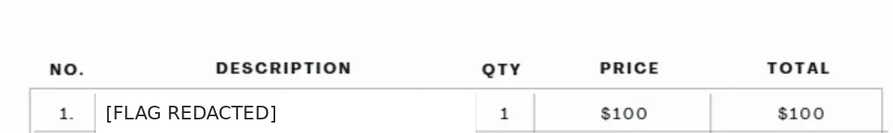

# ☀️ Management Wants a Word — TryHackMe Forensics Walkthrough

<p align="center">
  
</p>

<p align="center">
  
  
  
  
</p>

---

## 📌 Overview

This documentation presents an evidence-driven investigation of the **Management Wants a Word** room on **TryHackMe**.

The challenge follows a Windows forensic artifact chain from registry-hive analysis through DPAPI and Chrome credential recovery to a VeraCrypt container.

> **Environment:** Authorized TryHackMe Lab  
> **Assessment Type:** Digital Forensic Artifact Analysis  
> **Operating System:** Windows

---

## 📑 Table of Contents

- Executive Summary
- Investigation Methodology
- Evidence Acquisition and Triage
- SAM / SYSTEM Analysis
- DPAPI Analysis
- Chrome Encryption-Key Recovery
- Chrome Login Data
- VeraCrypt Analysis
- Evidence Correlation
- Security Findings
- Defensive Recommendations
- Lessons Learned
- Conclusion

---

# Executive Summary

The investigation begins with a Windows KAPE-style triage output associated with a user named **Vera**.

The supplied source material identifies a sequence of dependent artifacts:

```text
SAM + SYSTEM
      ↓
NT Hash
      ↓
DPAPI Master Key
      ↓
Chrome Local State
      ↓
Chrome AES Key
      ↓
Chrome Login Data
      ↓
Recovered Password
      ↓
VeraCrypt Container
      ↓
Final Artifact
```

The public documentation deliberately separates **captured evidence** from **source-described methodology**. No unsupported terminal output is presented as evidence.

---

# 1. Investigation Methodology

The room is primarily a **forensic correlation exercise**, not a conventional live-host exploitation chain.

| Phase | Purpose |
| --- | --- |
| Triage | Identify relevant Windows artifacts |
| Registry Analysis | Recover local credential material |
| DPAPI Analysis | Unlock dependent protected artifacts |
| Browser Analysis | Recover the Chrome encryption key and stored credential |
| Container Analysis | Correlate the recovered password with VeraCrypt |
| Evidence Correlation | Establish the final forensic conclusion |

---

# 2. Evidence Acquisition and Triage

The supplied source identifies the following evidence locations:

```text
Users\Vera\
Windows\System32\config\
```

The registry-hive directory is especially important because it contains:

```text
SAM
SYSTEM
SECURITY
```

<p align="center">

</p>

**Figure 1 — Supplied TryHackMe room overview and challenge metadata.**

---

# 3. SAM / SYSTEM Analysis

The SAM and SYSTEM hives provide the credential material required for offline local-account analysis.

The source methodology references:

```bash
python3 secretsdump.py -sam SAM -system SYSTEM LOCAL
```

The supplied walkthrough identifies the local account **`minivera`** as the account whose NT hash is required for the subsequent DPAPI stage.

> **Evidence boundary:** No raw `secretsdump.py` terminal screenshot was supplied. This command is therefore documented as source methodology rather than captured evidence.

---

# 4. DPAPI Analysis

The user's DPAPI master-key material is identified under:

```text
Users\Vera\AppData\Roaming\Microsoft\Protect\<SID>\
```

The recovered account credential material is then used to analyze the DPAPI-protected master key.

```text
User Credential
      ↓
DPAPI Master Key
      ↓
Protected Application Secrets
```

The source references DonPAPI or a forensic Python implementation for this stage.

---

# 5. Chrome Encryption-Key Recovery

The browser artifact identified by the challenge is:

```text
Users\Vera\AppData\Local\Google\Chrome\User Data\Local State
```

The relevant metadata is:

```text
os_crypt.encrypted_key
```

The forensic dependency is:

```text
DPAPI
  ↓
Chrome Encryption Key
```

This key is required to interpret encrypted values in Chrome's login database.

---

# 6. Chrome `Login Data`

The database is located at:

```text
Users\Vera\AppData\Local\Google\Chrome\User Data\Default\Login Data
```

The relevant database structure includes:

```text
logins
 ├── origin_url
 ├── username_value
 └── password_value
```

The challenge methodology describes decrypting the protected password value with the recovered Chrome AES key.

---

# 7. VeraCrypt Analysis

The recovered browser password is then correlated with the VeraCrypt container described by the challenge.

The source provides the following example workflow:

```bash
cryptsetup tcryptOpen <veracrypt_container_name> veracrypt_flag
mount /dev/mapper/veracrypt_flag /mnt/
```

The final stage is represented by the supplied artifact screenshot:

<p align="center">

</p>

**Figure 2 — Final invoice artifact with the TryHackMe flag redacted.**

---

# 8. Evidence Correlation

```text
Windows Triage
      │
      ├── SAM
      └── SYSTEM
            │
            ▼
       DPAPI Master Key
            │
            ▼
       Chrome Local State
            │
            ▼
       Chrome AES Key
            │
            ▼
       Chrome Login Data
            │
            ▼
       Recovered Password
            │
            ▼
       VeraCrypt Container
            │
            ▼
       Final Artifact
```

The key security observation is **credential reuse across trust boundaries**: a password recovered from one application becomes useful against a separate encrypted-storage boundary.

---

# 9. Security Findings

| Finding | Significance |
| --- | --- |
| Offline SAM/SYSTEM access | Enables offline credential analysis |
| DPAPI-dependent secrets | Protected application data can become recoverable after credential compromise |
| Browser-stored credentials | Endpoint compromise can expose saved credentials |
| Password reuse | One recovered secret can unlock unrelated protected data |
| Co-located artifacts | A single user profile can contain multiple high-value evidence sources |

---

# 10. Defensive Recommendations

### Windows

- Enable full-disk encryption.
- Restrict local administrator privileges.
- Protect endpoint backups and forensic acquisition locations.
- Monitor access to sensitive registry-hive files.

### Browser

- Minimize storage of privileged credentials.
- Use managed password-management solutions.
- Monitor access to browser profile databases.
- Rotate stored credentials after endpoint compromise.

### Credentials

- Use unique secrets for each security boundary.
- Avoid reusing browser passwords for encrypted containers.
- Protect DPAPI-dependent user profiles.

### Encrypted Storage

- Use unique, high-entropy container passwords.
- Store container credentials independently.
- Rotate credentials after exposure.

---

# 11. Lessons Learned

- Windows triage images contain highly interconnected artifacts.
- SAM/SYSTEM analysis is a foundation for offline local-account analysis.
- DPAPI is a critical dependency for Windows-protected application secrets.
- Chrome `Local State` and `Login Data` must be interpreted together.
- Browser credentials can become a bridge to unrelated protected resources.
- Forensic reports should clearly distinguish evidence from procedural methodology.

---

# 12. Conclusion

**Management Wants a Word** demonstrates a complete forensic artifact chain in which registry hives, DPAPI, Chrome credential storage, and an encrypted container are correlated to reach the final challenge artifact.

The most important defensive lesson is that encryption boundaries are only as strong as the credentials protecting them. Reusing a browser credential as an encrypted-container password can collapse otherwise independent security controls.

Challenge flags are intentionally redacted. The report focuses on the investigation methodology, artifact relationships, evidence handling, and defensive implications.

---

## Repository Information

| Project | Value |
| --- | --- |
| Repository | Management-Wants-a-Word-TryHackMe-Walkthrough |
| Author | Anurag Revankar |
| Category | Digital Forensics |
| Platform | TryHackMe |
| Environment | Authorized Training Lab |

> **Disclaimer:** This documentation was created for an authorized TryHackMe training environment. Challenge flags are intentionally redacted to preserve academic integrity.
